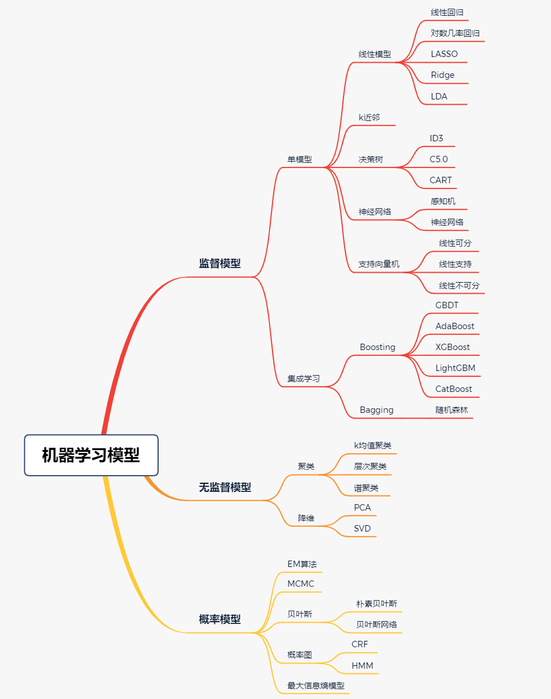

# Machine_Learning_Code_Implementation

### 关于
本仓库为《机器学习 公式推导与代码实现》一书配套代码库，相较于书中代码而言，仓库代码随时保持更新和迭代。

### 模型介绍

### 全书勘误
|  序号   | 所在页码  | 具体问题 | 勘误类型 | 修改 |
|  ----  | ----  | ----  | ----  | ----  |
| 1  | 彩插第1页 | 图3-6逻辑回归描述与正文不统一 | 文字或格式错误 | 逻辑回归应改为对数几率回归 |
| 2  | 11 | 代码第4行 | 技术错误 | #矩阵点乘 应改为 #矩阵乘法 |
| 3  | 32 | 式3-9 | 技术错误 | 中间+号应为x号 |
| 4  | 35 | 代码3-2倒数第4行和第6行 | 技术错误 | 两行中的a-y应改为y-a |
| 5  | 36 | 代码3-3第23和24行 |  技术错误  | 两行中的-号应改为+号 |
| 6  | 43 | 图4-1缺少横纵坐标名称 | 文字或格式错误 | 应补充横坐标为w1，纵坐标为w2 |
| 7  | 44 | 图4-2缺少横纵坐标名称 | 文字或格式错误 | 应补充横坐标为x，纵坐标为y |
| 8  | 50 | 图4-4缺少横纵坐标名称 | 文字或格式错误 | 应补充横坐标为w1，纵坐标为w2 |
| 9  | 68 | 代码6-6倒数第一行多一个右括号 | 文字或格式错误 | 去掉该括号 |
| 10 | 70 | 代码6-8第9和11行没有对齐 | 文字或格式错误  | 应与其他行对齐 |
| 11 | 71 | 该页Kneighbors中的n应大写 | 文字或格式错误 | 应改为KNeighbors |
| 12 | 77 | 表7-3数字统计错误 | 技术错误 | 应改为正确的统计数值：将“晴”和“雨”两行数值互换，相应的表格后第一个式子E(3,2)改为E(2,3)，E(2,3)改为E(3,2) |
| 13 | 79 | 倒数第四行名词错误 | 技术错误 | 应将信息增益比改为基尼指数 |
| 14  | 90 | 代码7-10中部分变量命名不统一 | 技术错误 | 应统一best_subsets、left_branch、feature_ix等变量 |
| 15  | 92 | 代码7-11倒数第3行变量有误 | 技术错误 | 应将impurity_calculation改为gini_impurity_calc，_leaf_value_calculation改为leaf_value_calc |
| 16  | 111 | 代码8-12倒数第9行  | 技术错误  | 多了一个parameter参数，应去掉  |
| 17  | 119 | 第一段第一行L(x,α,β)有误 | 技术错误  | 应改为L(w,b,α) |
| 18  | 167 | 图12-1倒数第2行最优点式子有误 | 技术错误 | 应改为式12-18 |
| 19  | 216 | 代码17-7第12行函数参数写反 | 技术错误  | 应对调修改 |
| 20  | 244 | 代码21-5倒数第6行可以与上一行进行合并 | 建议 | 应合并为一行 |
